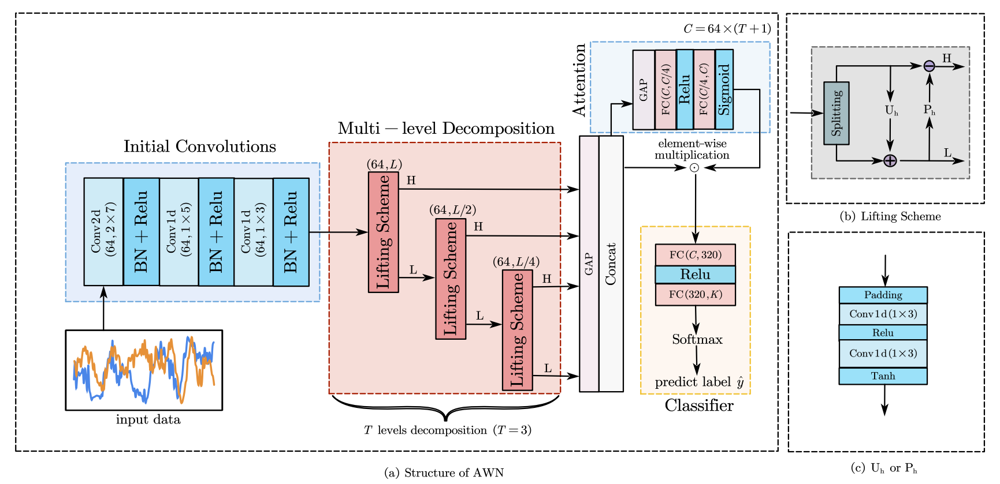
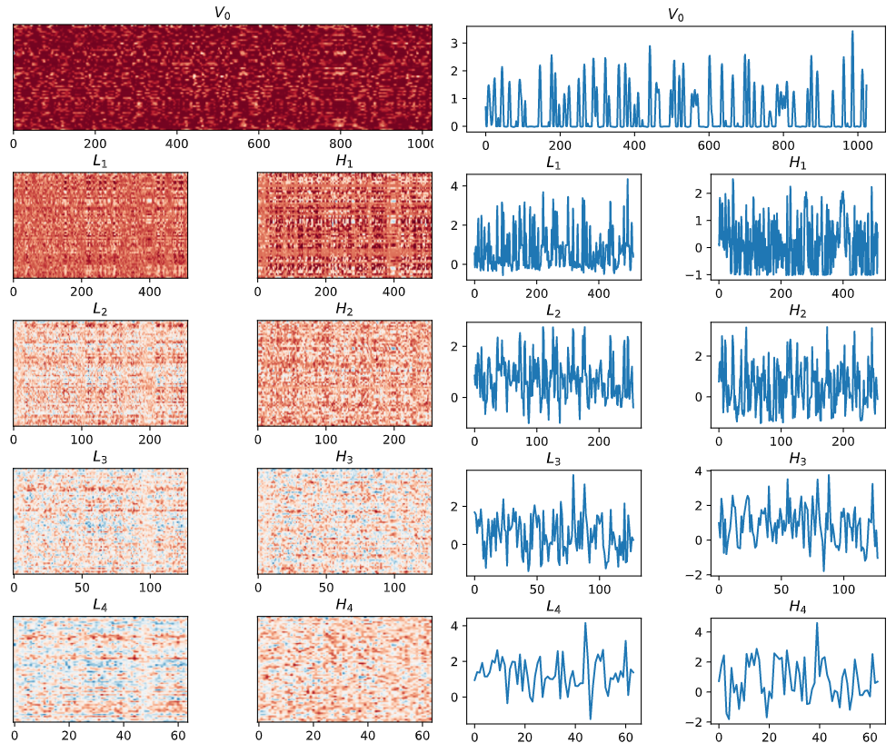

# AWN

Code for "Towards the Automatic Modulation Classification with Adaptive Wavelet Network".

Jiawei Zhang, Tiantian Wang, [Zhixi Feng](https://faculty.xidian.edu.cn/FZX/zh_CN/index.htm), and [Shuyuan Yang](https://web.xidian.edu.cn/syyang/)

Xidian University

[[Paper](https://ieeexplore.ieee.org/document/10058977)] | [[中文文档](doc-CN/README.md)] | [[code](https://github.com/zjwXDU/AWN)]



## Preparation

### Data

We conducted experiments on three datasets, namely RML2016.10a, RML2016.10b, and RML2018.01a.

| dataset     | modulation formats                                           | samples              |
| ----------- | ------------------------------------------------------------ | -------------------- |
| RML2016.10a | 8 digital formats: 8PSK, BPSK, CPFSK, GFSK, PAM4, 16QAM, 64QAM, QPSK; 3 analog formats: AM-DSB，AM-SSB，WBFM | 220 thousand (2×128) |
| RML2016.10b | 8 digital formats: 8PSK, BPSK, CPFSK, GFSK, PAM4, 16QAM, 64QAM, QPSK; 3 analog formats: AM-DSB，WBFM | 1.2 million (2×128)  |
| RML2018.01a | 19 digital formats: 32PSK, 16APSK, 32QAM, GMSK, 32APSK, OQPSK, 8ASK, BPSK, 8PSK, 4ASK, 16PSK, 64APSK, 128QAM, 128APSK, 64QAM, QPSK, 256QAM, OOK, 16QAM; 5 analog formats: AM-DSB-WC, AM-SSB-WC, AM-SSB-SC, AM-DSB-SC, FM, | 2.5 million (2×1024) |

The datasets can be downloaded from the [DeepSig](https://www.deepsig.ai/). Please extract the downloaded compressed file directly into the `./data` directory, and keep the file name unchanged. The final directory structure of `./data` should is shown below:

```
data
├── GOLD_XYZ_OSC.0001_1024.hdf5
├── RML2016.10a_dict.pkl
└── RML2016.10b.dat
```

### Pretrained Model

We provide pre-trained models on three datasets, which can be downloaded from [Google Drive](https://drive.google.com/file/d/1vJnjuPFFbraEc__F8AXhbzFyWwooMWoL/view?usp=share_link) or [Baidu Netdisk](https://pan.baidu.com/s/1GjITK7VL_PrIcbZ8zc3oSw?pwd=6znj). Please extract the downloaded compressed file directly into the `./checkpoint` directory.

### Environment Setup

- Python >= 3.6
- PyTorch >=1.7

This version of the code has been tested on Pytorch==1.8.1.

## Training

Run the following commands to train the AWN. (`<DATASET>` in {2016.10a, 2016.10b, 2018.01a}).

```
python main.py --mode train --dataset <DATASET>
```

The YAML configs for three datasets lies in `./config`.

After running the command, a new directory `<DATASET>_$` will be created in the `./training` directory, and `./models`, `./result`, `./log` directories will be created under `./<DATASET>_$`. The trained model will be saved to `./models`, and the training logs will be saved to `./log`. The loss, accuracy, and learning rate changes during training and validation will be plotted together in `./result`.

After the training is completed, an testing on the test set will be performed automatically, which can be referred to in the *Evaluation* section.

## Evaluation

Run the following command to evaluate the trained AWN:

```
python main.py --mode eval --dataset <DATASET>
```

After running the command, a new directory `<DATASET>_$` will be created in the `./inference` directory, which is consistent with the *Training* section. *The overall accuracy*, *macro F1-score*, and *Kappa coefficient* on the test set will be displayed in the terminal. The test logs will be saved to `./log`, and the accuracy curve with respect to SNRs and confusion matrix will be saved to `./result`.

If you have further analysis needs, we recommend modifying the `Run_Eval()` function to directly save the raw data, such as *Confmat_Set*.

## Visualize



We provide an additional mode to visualize the decomposition of the feature maps by the adaptive lifting scheme, which can be called by the following command:

```
python main.py --mode visualize --dataset <DATASET>
```

Similar to *Evaluation*, the plotted figures are stored in `./result` in the form of `.svg`.

## Acknowledgments

Some of the code is borrowed from [DAWN](https://github.com/mxbastidasr/DAWN_WACV2020). We sincerely thank them for their outstanding work.

## License

This code is distributed under an [MIT LICENSE](https://github.com/zjwXDU/AWN/blob/main/LICENSE). Note that our code depends on other libraries and datasets which each have their own respective licenses that must also be followed.

## Citation

Please consider citing our paper if you find it helpful in your research:

```
@ARTICLE{10058977,
	author={Zhang, Jiawei and Wang, Tiantian and Feng, Zhixi and Yang, Shuyuan},
	journal={IEEE Transactions on Cognitive Communications and Networking}, 
	title={Towards the Automatic Modulation Classification with Adaptive Wavelet Network}, 
	year={2023},
	doi={10.1109/TCCN.2023.3252580}
}
```


Contact at: zjw AT stu DOT xidian DOT edu DOT cn
